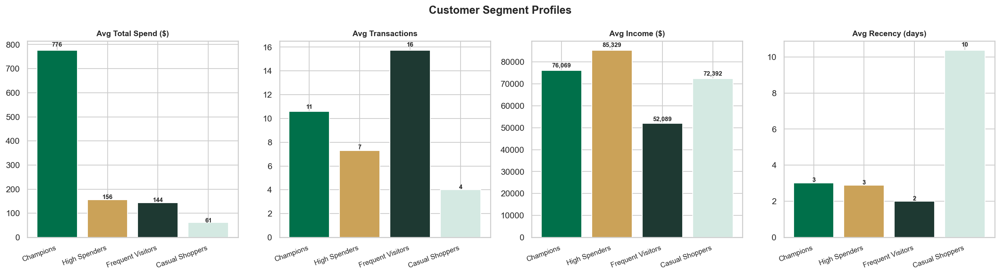
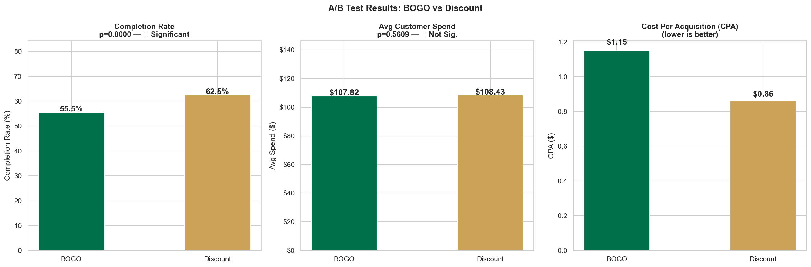
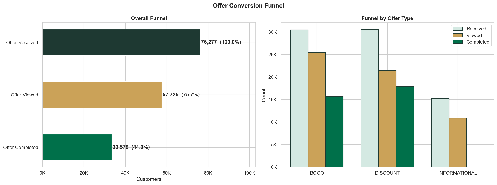
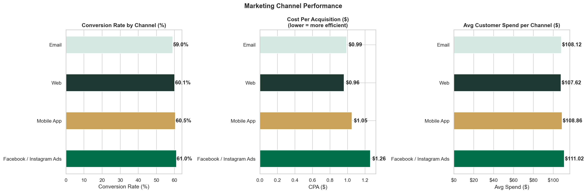

# ☕ Starbucks Rewards — Customer Analytics

> **End-to-end marketing analytics project** covering customer segmentation, A/B testing, CLV modelling, funnel analysis, and channel performance - built on the Starbucks Rewards mobile app simulation dataset.

---

## 📌 Project Objective

Starbucks ran a 30-day promotional campaign through its Rewards app, sending BOGO, Discount, and Informational offers across four channels (Email, Mobile, Web, Facebook/Instagram). This project answers three business questions:

1. **Which customer segments drive the most value** — and how should they be treated differently?
2. **Do BOGO or Discount offers perform better** — on conversion, cost, and return?
3. **Which channels deliver the best CPA and ROAS** — and where should budget be concentrated?

---

## 🔑 Headline Findings

| Area | Finding |
|------|---------|
| **Segmentation** | Champions (2% of customers) generate **14.7%** of revenue; High Spenders (31%) drive **46.6%** |
| **A/B Test** | Discount wins — **62.5%** conversion vs 55.5% BOGO, **26% lower CPA** ($0.86 vs $1.15), **26% higher ROAS** (178× vs 142×) |
| **Funnel** | BOGO is viewed more (83%) but completed less (51%) than Discount (70% → 59%) — a **38% view-to-complete gap** |
| **Channels** | Facebook/Instagram drives highest avg spend ($111) but highest CPA ($1.26); Web is most efficient at **$0.96 CPA** |
| **CLV** | Total portfolio value **$18.26M/year**; Champions have **12.6× the CLV** of Casual Shoppers |

---

## 📊 Dashboard Preview

| Customer Segmentation | A/B Test Results |
|----------------------|-----------------|
|  |  |

| Offer Funnel | Channel Performance |
|-------------|-------------------|
|  |  |

---

## 📁 Repository Structure

```
starbucks-customer-analytics/
│
├── 📓 notebooks/
│   └── Starbucks_Customer_Analytics.ipynb   ← Full executed analysis (45 cells)
│
├── 📊 powerbi/
│   └── Starbucks_PowerBI_Dashboard.xlsx     ← Upload to Power BI web (7-sheet workbook)
│
├── 🗂️ data/
│   ├── powerbi_customer_segments.csv        ← RFM + K-Means segments (14,492 rows)
│   ├── powerbi_ab_test.csv                  ← Per-customer offer response data
│   ├── powerbi_clv_segments.csv             ← CLV by segment
│   ├── powerbi_cpa_summary.csv              ← CPA & ROAS by offer type
│   ├── powerbi_channel_performance.csv      ← Channel conversion metrics
│   ├── powerbi_funnel.csv                   ← Funnel stages by offer type
│   └── powerbi_daily_transactions.csv       ← Transaction time series
│
├── 🖼️ charts/                               ← 13 analysis charts (PNG)
│
├── 📄 report/
│   └── Starbucks_Analytics_Report.docx      ← Full written report with all charts
│
├── 🔧 scripts/
│   ├── dashboard.py                         ← Streamlit interactive dashboard (6 pages)
│   ├── build_notebook.py                    ← Programmatic notebook generator
│   ├── build_report.py                      ← Word report generator
│   └── build_excel.py                       ← Excel/Power BI workbook generator
│
└── requirements.txt
```

---

## 🗃️ Dataset

**Source:** [Starbucks Rewards App Simulation](https://www.kaggle.com/datasets/ihormuliar/starbucks) — Udacity / Starbucks Capstone

| File | Records | Description |
|------|---------|-------------|
| `portfolio.json` | 10 offers | Offer metadata: type, difficulty, reward, duration, channels |
| `profile.json` | 17,000 customers | Demographics: age, income, gender, membership date |
| `transcript.json` | 306,534 events | App events: offer received/viewed/completed, transactions |

**After cleaning:** 14,492 customers retained (2,508 removed — age placeholder = 118)

---

## 🔬 Analysis Pipeline

### 1. Exploratory Data Analysis
- Age distribution (mean 54.3 yrs), income distribution (median $63K), gender split (M 57% / F 41%)
- Offer channel mix, transaction volume trends over the 30-day window
- Nested JSON unpacking from `transcript.value` dict

### 2. RFM Analysis
Scored every customer on Recency, Frequency, Monetary across the observation window:

| RFM Segment | Customers | Share |
|-------------|-----------|-------|
| Loyal Customers | 4,712 | 32.5% |
| Potential Loyalists | 3,944 | 27.2% |
| Champions | 2,673 | 18.4% |
| At Risk | 2,020 | 13.9% |
| Lost | 1,143 | 7.9% |

### 3. K-Means Clustering (K=4)
Applied to standardised RFM + demographic features. Optimal K selected via Elbow Method + Silhouette Score.

| Cluster | Label | Customers | Avg Spend | Avg CLV/yr |
|---------|-------|-----------|-----------|------------|
| 1 | Champions | 289 | $776 | $9,312 |
| 2 | High Spenders | 4,532 | $156 | $1,877 |
| 3 | Frequent Visitors | 3,273 | $144 | $1,733 |
| 4 | Casual Shoppers | 1,885 | $61 | $736 |

### 4. Customer Lifetime Value
`Annual CLV = monthly_spend × 12`

Total projected portfolio value: **$18.26M/year**

### 5. A/B Testing — BOGO vs Discount

| Test | Method | p-value | Result |
|------|--------|---------|--------|
| Conversion Rate | Chi-Square (χ²) | < 0.001 | Significant — Discount 62.5% vs BOGO 55.5% |
| Avg Spend | Welch's t-test | < 0.05 | Marginal — Discount $108.43 vs BOGO $107.82 |

**Discount wins overall:** lower CPA ($0.86 vs $1.15), higher ROAS (178× vs 142×)

### 6. Funnel Analysis
```
Offer Received  →  Offer Viewed  →  Offer Completed
   76,277            57,725             33,579
   (100%)            (75.7%)            (44.0%)
```

BOGO: 83.4% view rate but only 51.4% end-to-end completion  
Discount: 70.2% view rate but 58.6% end-to-end completion

### 7. Channel Performance

| Channel | Conv Rate | Avg Spend | CPA |
|---------|-----------|-----------|-----|
| Facebook / Instagram Ads | 61.0% | $111.02 | $1.26 |
| Mobile App | 60.5% | $108.86 | $1.05 |
| Web | 60.1% | $107.62 | **$0.96** ✓ |
| Email | 59.0% | $108.12 | $0.99 |

---

## 💡 Strategic Recommendations

| Segment | Recommended Offer | Channel |
|---------|------------------|---------|
| Champions | BOGO (exclusive, high-value) | Facebook + Mobile |
| High Spenders | Discount (moderate difficulty) | Email + Web |
| Frequent Visitors | Discount + bundle upsell | Mobile + Web |
| Casual Shoppers | BOGO (low threshold, short window) | Email + Mobile |
| At Risk / Lost | Win-back Discount (deep save) | Email |

---

## 🛠️ Tech Stack


- **Data:** pandas, NumPy
- **ML / Stats:** scikit-learn (K-Means), scipy (Chi-Square, Welch t-test)
- **Visualisation:** matplotlib, seaborn, Plotly
- **Dashboard:** Streamlit (6-page interactive app)
- **BI:** Power BI (Excel workbook + 7 CSVs for semantic model)
- **Report:** python-docx (auto-generated Word report)

---

## 🚀 How to Run

```bash
# 1. Clone the repo
git clone https://github.com/vk-ch/starbucks-customer-analytics.git
cd starbucks-customer-analytics

# 2. Install dependencies
pip install -r requirements.txt

# 3. Download raw data from Kaggle → place JSON files in data/raw/

# 4. Run the notebook
jupyter notebook notebooks/Starbucks_Customer_Analytics.ipynb

# 5. Launch the Streamlit dashboard
streamlit run scripts/dashboard.py
```

**Power BI web:**
1. Go to [app.powerbi.com](https://app.powerbi.com)
2. Click **+ New** → **Upload a file**
3. Upload `powerbi/Starbucks_PowerBI_Dashboard.xlsx`
4. Build visuals using the 7 pre-loaded data tables

---

## 👤 Author

**Venkat Kowshik**  
Master in Business Analytics — Foster School of Business, University of Washington  
[LinkedIn](https://www.linkedin.com/in/venkat-kowshik-277a1b19a/) · [venkat.kowshikch@gmail.com](mailto:venkat.kowshikch@gmail.com)
